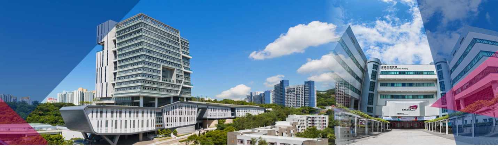

 
 

  
   <i> </i>

# Ph.D. and Postdoctoral Fellow Positions in Data Science  
**City University of Hong Kong**  

There are Ph.D. and Postdoc openings at Dr. Jiaman Wu’s lab in the Department of Data Science (DS), City University of Hong Kong (CityUHK). The lab focuses on combining large-scale datasets with computational techniques to support human-centered complex system operations.

---

## Research Focus

My research leverages large-scale human activity datasets to analyze and optimize energy and transportation systems. The methodologies and application areas are as follows.

**Methodologies**
    - Optimization (discrete, or stochastic)
    - Control Theory 
    - Machine learning and deep learning
    - Mechanism design and game theory
    - Network science and statistical physics of complex systems

**Applications**
    - Human dynamics modeling and analytics in transportation-energy systems
    - Vehicle-grid integration
    - Electric fleet operation and smart charging
    - Transportation-energy infrastructure planning
    - Smart grid management
    
---

## Prospective PhD Students

**Requirements**:  
I seek self-motivated, curious minds with backgrounds in Data Science, Computer Science, Operations Research and Industrial Engineering, Electrical Engineering, Civil Engineering, Mechanical Engineering, Applied Mathematics, or related fields. The minimum entrance requirements of CityUHK can be found [here](https://www.cityu.edu.hk/pg/research-degree-programmes/entrance-requirements).

**How to Apply**:  
If you are interested in working with me, please send an email to `jmwu@berkeley.edu` with the subject line:  
**"Prospective PhD Student - [Your Name] - [Expected Start Time]"**  
Include your CV, transcript, a brief paragraph describing your research interests, and any relevant materials.

---

## Open Postdoctoral Fellow Position

**Requirements**:  
Candidates applying for the Postdoctoral Fellow position should hold a Ph.D. in Data Science, Computer Science, Operations Research, Industrial Engineering, Electrical Engineering, Civil Engineering, Mechanical Engineering, Applied Mathematics, or a related field. Applicants should have demonstrated research experience aligned with the group’s core areas. Proficiency in at least one programming language is required. Preference will be given to candidates with publications in top-tier journals and conferences.

**How to Apply**:  
If you are interested in working with me, please send an email to `jmwu@berkeley.edu` with the subject line:  
**"Prospective Postdoc Fellow - [Your Name] - [Expected Start Time]"**  
Include your CV, a 1–2 page research statement, referee contact information, and any relevant materials.

---

## About the PI

Dr. Jiaman Wu will join CityUHK as an Assistant Professor in July 2025. She received her Ph.D. in Systems Engineering from UC Berkeley, and previously earned her B.Eng and M.Sc. from Wuhan University and Tsinghua University, respectively. Her research on data-driven energy and transportation system operations has been published in *Applied Energy*, *IEEE Transactions on Smart Grid*, and *Cell Reports Sustainability*. More information can be found on her [personal website](https://charmainewu.github.io/about/).

---

## About CityUHK

Located in the heart of Hong Kong, CityUHK is renowned as an innovative hub for research and education and for addressing global challenges. CityUHK is ranked **54th** in the *2025 U.S. News Global University Rankings*. The Department of Data Science is committed to becoming a world-class center for data science education and research. Notably, the **Data Science and AI program** is ranked **45th** in the *2025 QS World University Rankings*.

 
 

  
   <i> </i>

